# **Project - TCP Chatting Program**  🗯️💭🗨️

 ## 💡 `Java` PROJECT 


---

### 🧾 프로젝트 소개 

---

>**ECLIPSE 환경 구축**

> 1. ECLIPSE 설치
> 2. JDK 설치
> 3. JSON 라이브러리 설치(Build Path)<br>
https://repo1.maven.org/maven2/org/json/json/20220924/ (MAVEN REPOSITORY) <br>
https://github.com/stleary/JSON-java (Git Hub)

---


#### ◾ Chatting Server 구축 완료

- 서버 시작<br>
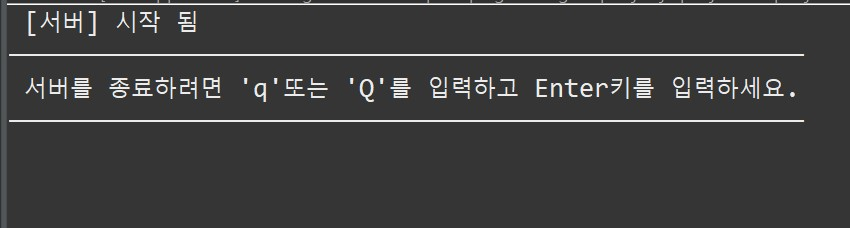

- 서버 1명 입장<br>
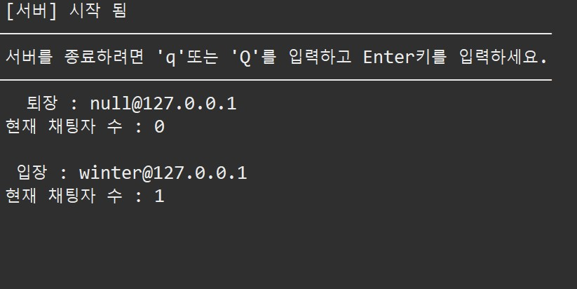<br>
(0명 입장은 클라이언트 쪽에서 종료)

##### 종료 확인 ('q' | 'Q')


---

#### ◾ Client Server 구축 완료

- 클라이언트 시작<br>
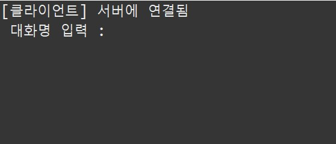

- 클라이언트 입력(입장)<br>
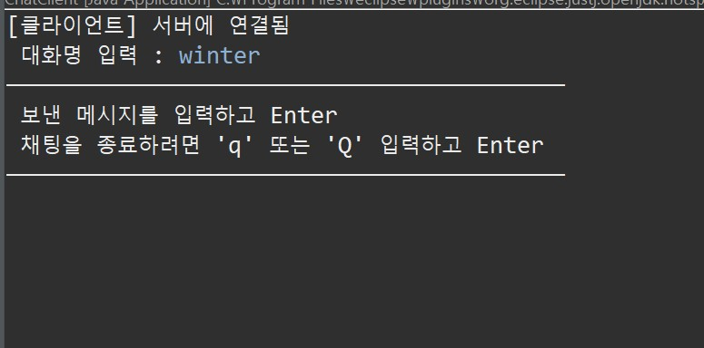

---

##### 종료 확인 ('q' | 'Q')
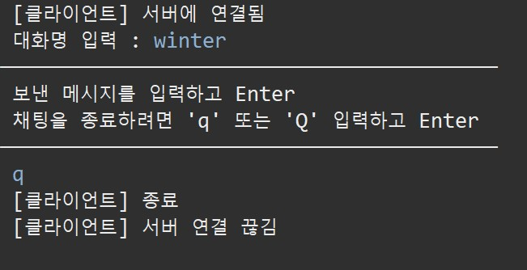
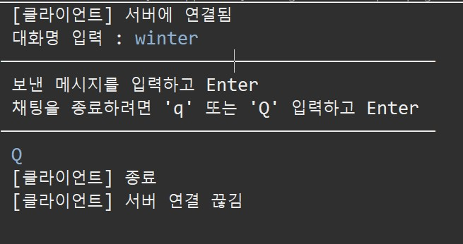

---

#### ◾ Catting
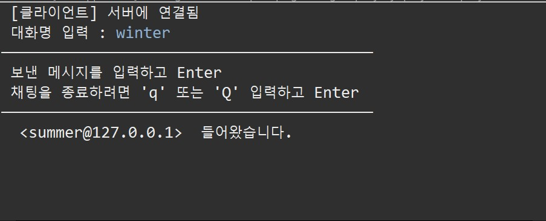<br><br>
서버 상태<br>
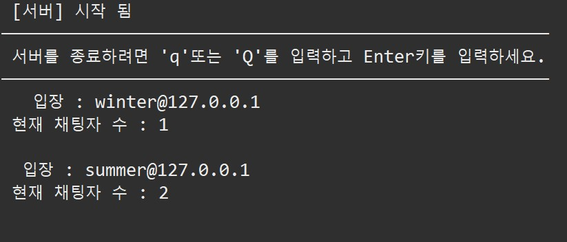<br><br>
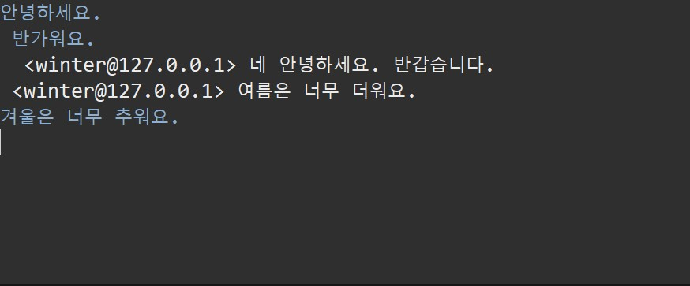<br>
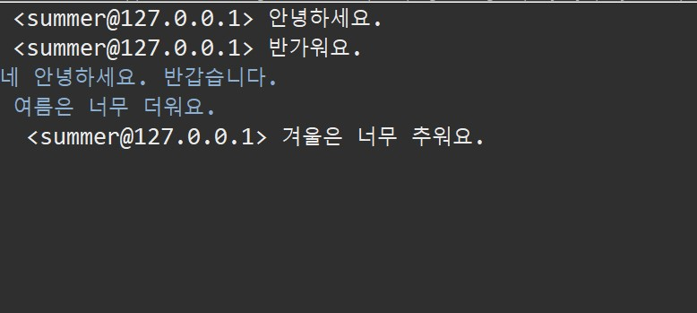<br><br>
클라이언트 종료(나가기)<br>
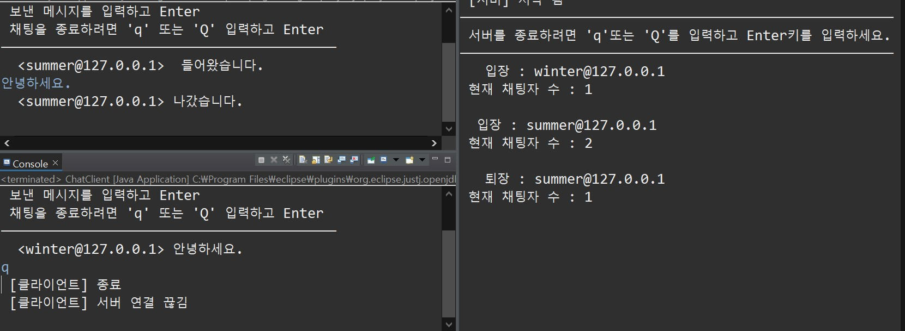


```
rest time :D

종료 확인 ('q' | 'Q')
toLowerCase()와 equals() 메소드를 활용하여 구현

┌──────────────────────────────────────────────┐
│ 클라이언트 버그 존재                          │
│ 채팅 전 바로 q 또는 Q누르면 서버가 종료되지만, │ 
│ 채팅 후 q 또는 Q누르면 종료 안 되는 현상 존재  │
└──────────────────────────────────────────────┘
```


