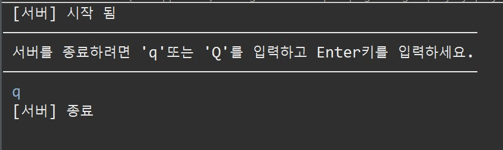
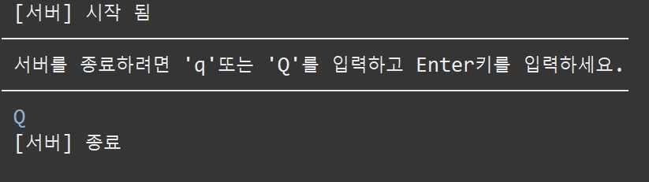

# **Project - TCP Chatting Program**  🗯️💭🗨️

 ## 💡 `Java` PROJECT 


---

### 🧾 프로젝트 소개 

---

>**ECLIPSE 환경 구축**

> 1. ECLIPSE 설치
> 2. JDK 설치
> 3. JSON 라이브러리 설치(Build Path)<br>
https://repo1.maven.org/maven2/org/json/json/20220924/ (MAVEN REPOSITORY) <br>
https://github.com/stleary/JSON-java (Git Hub)

---


#### ◾ Chatting Server 구축 완료

---

#### ◾ Client Server (미완)

---

##### 종료 확인 ('q' | 'Q')



```
rest time :D

종료 확인 ('q' | 'Q')
toLowerCase()와 equals() 메소드를 활용하여 구현

```


